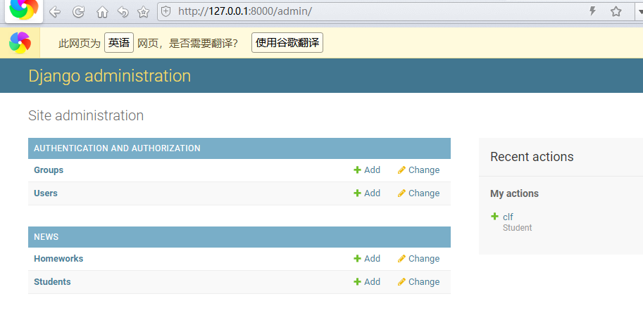
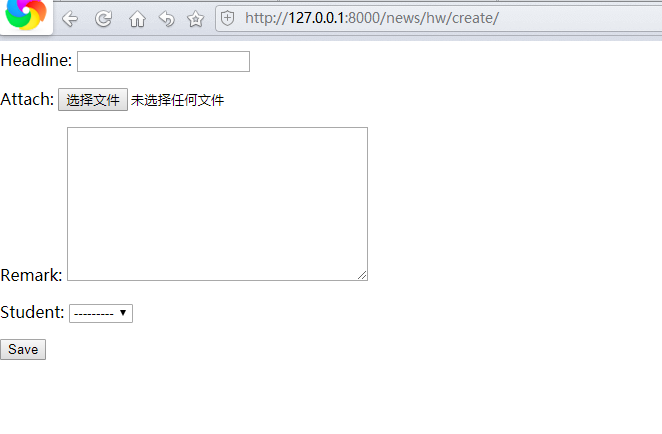

# 分布式系统与云计算大作业

## 作业要求

使用Django开发一个云盘系统

## 作业完成过程

## 主要问题和解决方法

### 过程1 使本地仓库与远程仓库同步

解决办法：生成本地的公私钥对，并将公钥内容复制到git服务器的ssh密钥中。

步骤如下：

在本地git bash（windows）、命令行中运行命令生成公私钥对：ssh-keygen

将 ~/.ssh/id_rsa.pub文件的内容复制到git服务器的ssh 秘钥中。

### 过程2 新建news app 并增加基本功能

根据学习文档，以及克隆老师的仓库数据，对自己的admin,models,urls,views等文件内修改代码，再保存并上传至git仓库

### 过程3 完善html页面

通过修改代码，将已定义article,reporter改为我们所需要的student,homework,并修改相应的文件，同时要增加一个homework_form.html文件。

## 作业结果展示

