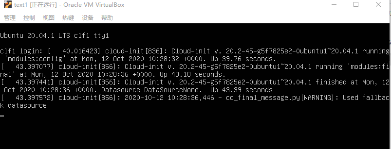
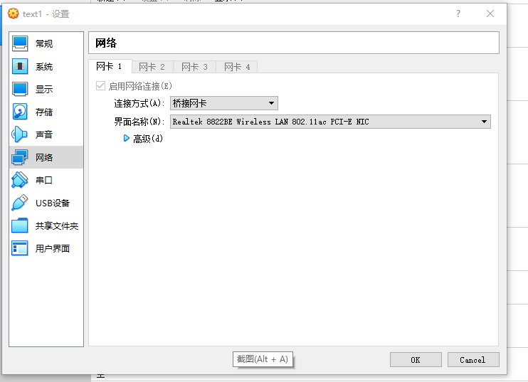
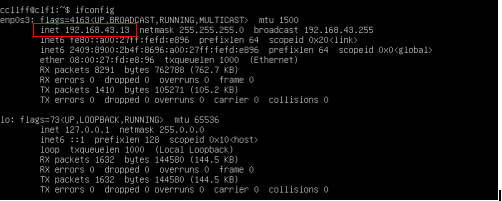
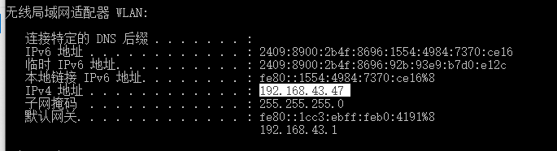
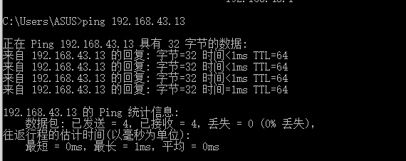
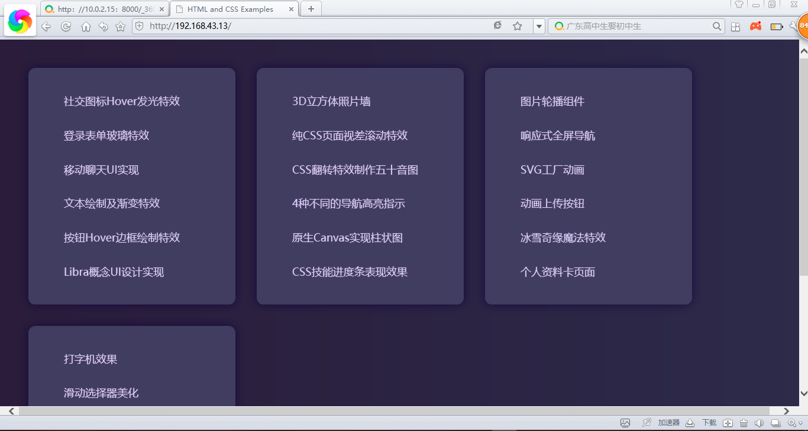

# 虚拟机作业

## 1.在虚拟机中安装Linux服务器版本操作系统（可以选择ubuntu 20.04。服务器版本的操作系统特点是只有命令行，所有操作需要通过命令完成。）

操作步骤：

首先下载ubuntu20.04，再在虚拟机中安装,安装结果如下图：

## 2.配置虚拟机网络为桥接。虚拟机开机后，查看虚拟主机地址（使用ifconfig命令）

配置为桥接步骤：

设置——网络——桥接网卡

查看虚拟主机地址：

步骤：

命令行输入：sudo apt install net-tools

再输入：ifconfig

结果如下图，得到虚拟主机地址为：192.168.43.13

## 3.可以在host主机中ping通虚拟机内的guest主机，也可以在guest主机中ping通host主机

①在guest主机中ping通host主机步骤：

首先在本地主机cmd使用命令行:ipconfig得到本地主机的地址：192.168.43.47

再在虚拟主机内使用命令行：ping 192.168.43.47,结果如下图：

②在host主机中ping通虚拟机内的guest主机步骤：

直接在主机cmd中输入命令：ping 192.168.43.13，结果如下图所示：

## 4.在guest主机中开通http server服务。可以通过python3自带的http模块（使用课堂上演示的命令）。在host主机中可以通过浏览器访问guest主机中的http服务中的html文件

首先在虚拟机内克隆http实例，git clone <https://github.com/zxuqian/html-css-examples.git>

运行此代码：python3 -m http.server --directory html-css-examples 80

再在本地浏览器中输入虚拟机的ip地址进行访问，结果如下：

